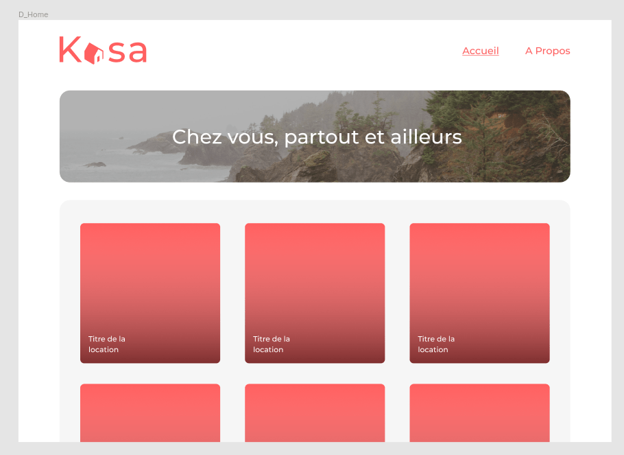

# Formation développeur d'application - Javascript React

## Développez une application Web avec React et React Router
_Projet 11 - Kasa - Aout 2022_

## Mission 
Mettre en place une application React et utilisé react router. 

## Liens maquettes
https://www.figma.com/file/bAnXDNqRKCRRP8mY2gcb5p/UI-Design-Kasa-FR?node-id=0%3A1

## Compétences évaluées  

* Développer les routes d'une application web avec React Router  
* Initialiser une application web avec un framework 
* Créer des composants avec React

## Techno utilisés pour le projet  

* ### frontend
  * React
  * React-Router
  * CSS
  * JavaScript

